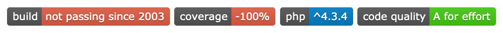
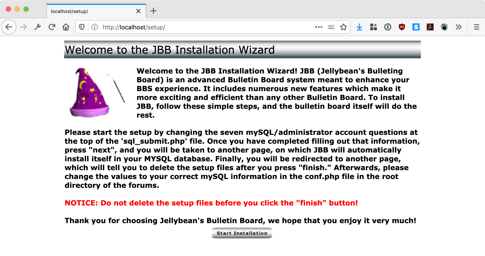
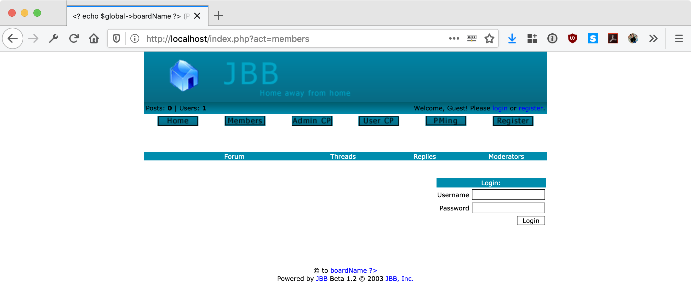

A PHP4-based bulletin board creatively titled **Jake's Bulletin Board**. This was my first-ever full programming creation back in 2003 (if you couldn't tell) saved for posterity after being rescued from a dust-caked floppy disk.

## Usage

If you're bored on a rainy day, potential activities could include:

- Easiest code review you'll do in your entire career. (Or hardest, depending on your attitude.)
- Hacking speed-runs to boost your infosec self-esteem.
- Beating the [world record for longest laugh](http://goldenbookofrecords.com/longest-laughter/), currently held by Mr. Belachew Girma of Ethiopia with 3 hours and 6 minutes.
- Actually getting this to run in 2019.

## Screenshots

## License

Do whatever the hell you want, it's not gonna work. 😉
